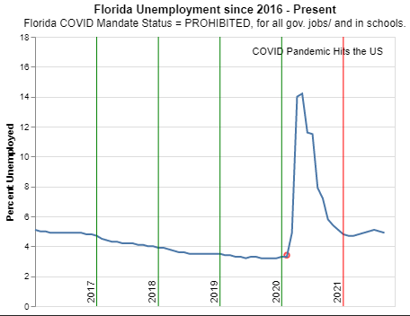
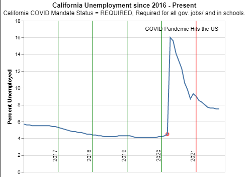
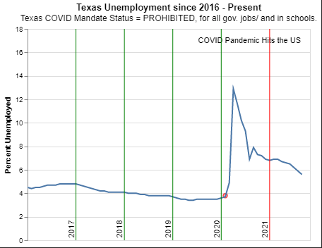
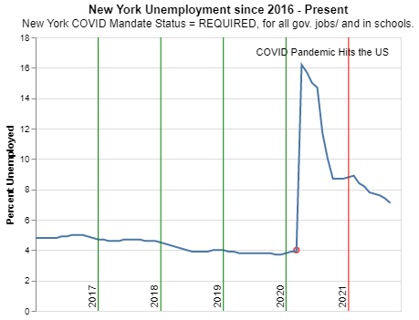
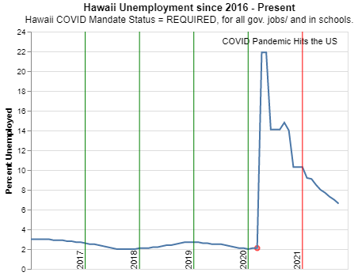
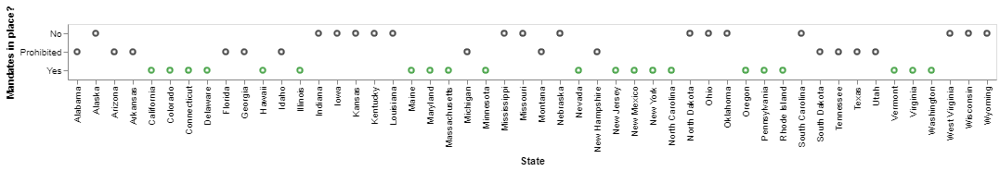
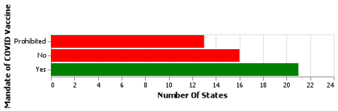
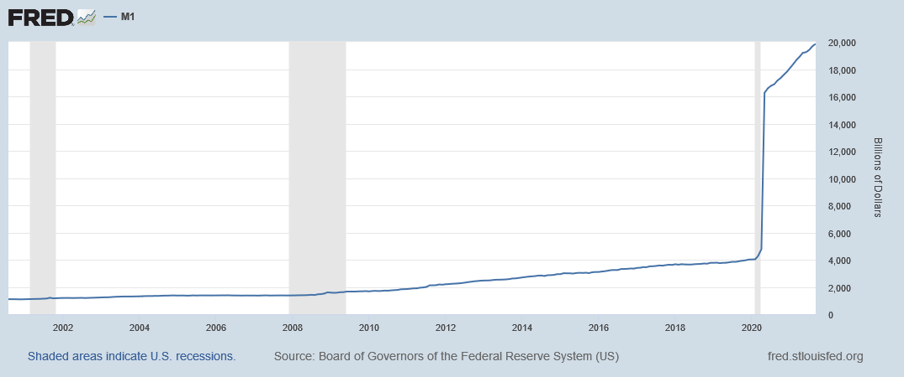
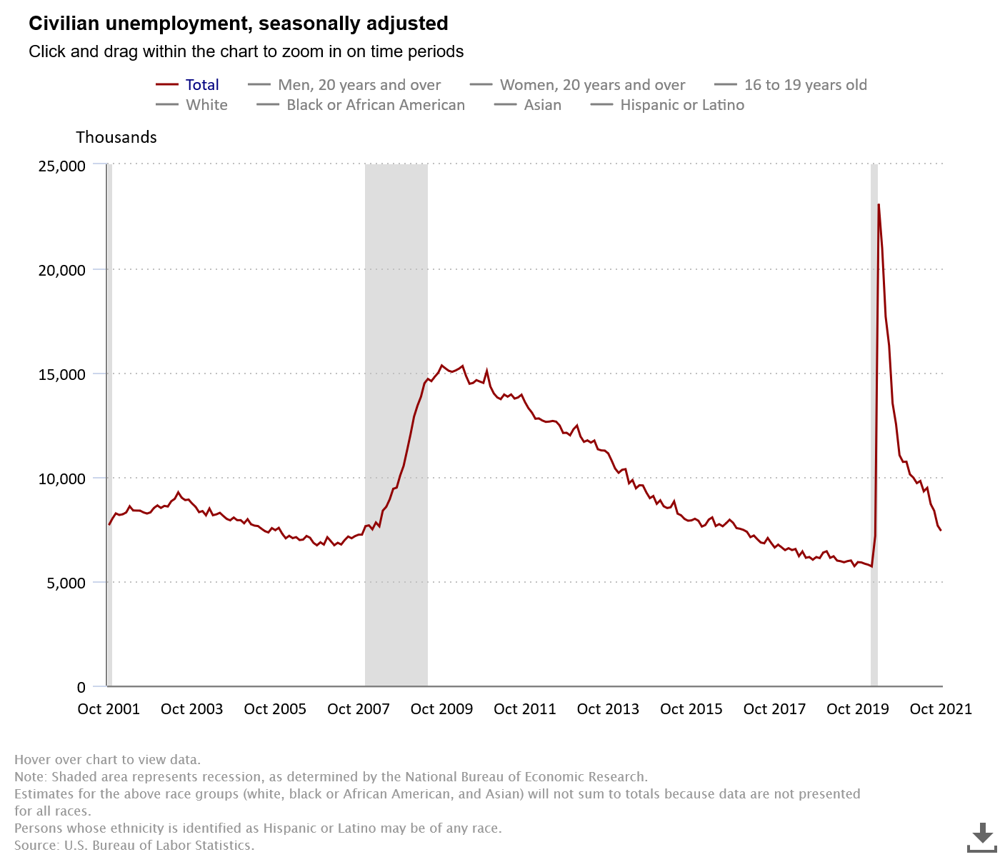

# Overview
For this small project I really wanted to get better at cleaning data as well as find trends in that data.

I grabbed a couple of data sets for this small project. Here are the following links to go to the data 
* M1 Money supply data set : https://fred.stlouisfed.org/series/M1SL
* Unemployment rates : https://download.bls.gov/pub/time.series/ln/

One of the purposes for me looking at these datasets was to find a correlation. I also wanted to develop my skills with cleaning and looking at data in different way. It was really fun to do this with the few states that i had selected. I tried to select the states that have really large populations in areas and have opposing views on the vaccine. Below are the charts that i have created

Here is a video of me demoing the code and just going over the charts as well! 
[Software Demo Video](http://youtube.link.goes.here)

# Data Analysis Results

## 1. Does mandating COVID vaccine affect the rate of unemployment?

### There is a small correlation between the data we see here.
### Full list of states status on vaccine mandates

### count of those states.

# Development Environment
I used Visual Studio code as my IDE. 

I Used python and pandas to help with managing the data sets that i downloaded. 
I also used Altair to create charts and help with vizualizing the data.
# Useful Websites

{Make a list of websites that you found helpful in this project}
* [Altair Documentation](https://altair-viz.github.io/index.html)
* [Pandas Documentation](https://pandas.pydata.org/docs/)
* [Unemployment data](https://www.bls.gov/charts/employment-situation/civilian-unemployment.htm)
# Future Work

{Make a list of things that you need to fix, improve, and add in the future.}
* Some more charts looking into infection rates compared to unemployment and see if they are correlated in any way.
* A look into unemployment and how that might affect the M1 money supply.
* 
