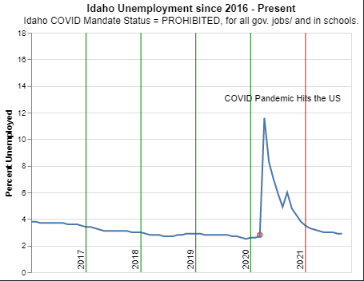

# Overview

{Important!  Do not say in this section that this is college assignment.  Talk about what you are trying to accomplish as a software engineer to further your learning.}

{Provide a description of the data set that you are analyzing.  Include the link of where you obtained the data.}

{Describe your purpose for writing this software to analyze the data.}

{Provide a link to your YouTube demonstration.  It should be a 4-5 minute demo of the data set, the questions and answers, the code running and a walkthrough of the code.}

[Software Demo Video](http://youtube.link.goes.here)

# Data Analysis Results

1. Does mandating COVID vaccine affect the rate of unemployment?

There is a small correlation between the data we see here.
Full list of states status on vaccine mandates

count of those states.

# Development Environment
I used Visual Studio code as my IDE. 

I Used python and pandas to help with managing the data sets that i downloaded. 
I also used Altair to create charts and help with vizualizing the data.
# Useful Websites

{Make a list of websites that you found helpful in this project}
* [Altair Documentation](https://altair-viz.github.io/index.html)
* [Pandas Documentation](https://pandas.pydata.org/docs/)

# Future Work

{Make a list of things that you need to fix, improve, and add in the future.}
* Some more charts looking into infection rates compared to unemployment and see if they are correlated in any way.
* A look into unemployment and how that might affect the M1 money supply.
* 